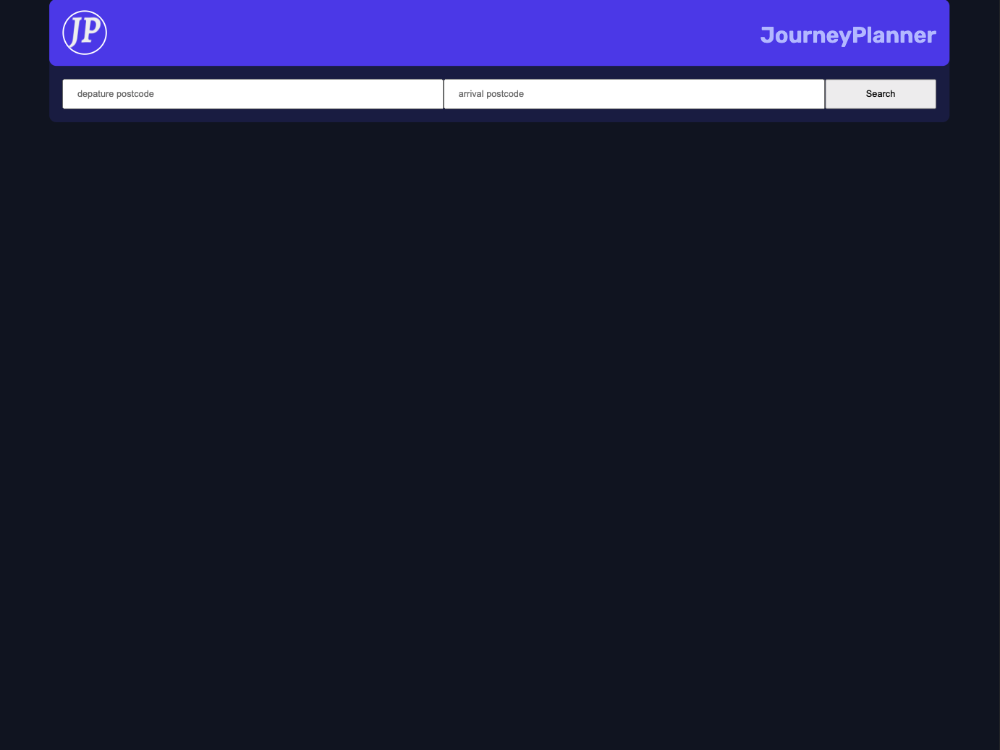
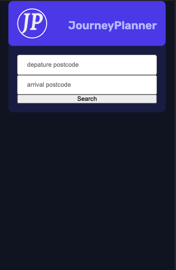

# Journey Planner - How to plan your travel around London


Desktop Preview





Mobile Preview





## Welcome! 👋

Thanks for checking out this project based on the Transport for London API.

### The Project

Users should be able to:

- Enter a start point of their journey
- Enter a destination point of their journey
- Click the search button
- Render results on how a user would get to their journey with instructions

### Links

- Solution URL: (https://github.com/clivepato93/journeyPlanner)
- Live Site URL: (https://clivepato93.github.io/journeyPlanner/)


## My process

### Built with

- Semantic HTML5 markup
- CSS custom properties
- Flexbox
- Mobile-first workflow
- JS

### What I learned

I learned how to retrieve information from a complex API as it contained many objects with arrays etc.

```js

    // Functions to get time in 24hr format
    const getHour = (date) => `${new Date(date).getHours()}`.padStart(2,0);
    const getMinutes = (date) => `${new Date(date).getMinutes()}`.padStart(2,0);
    // Price of travel
    const getPrice = (value) => `${value}`.slice(0,-2)+'.'+`${value}`.slice(-2);

    const res = await fetch(link)
      
    const data = await res.json();

    if(!res.ok) throw new Error(`Please check the locations are valid`)


    let {journeys,journeyVector:{to}} = data

      const trips =  journeys.map(journey => {
         const depatureHours = getHour(journey.startDateTime);
         const depatureMinutes = getMinutes(journey.startDateTime);
         const arrivalHours = getHour(journey.arrivalDateTime);
         const arrivalMinutes = getMinutes(journey.arrivalDateTime);
         const totalFare = journey.fare?+getPrice(journey.fare.totalCost):0;
         const totalString = journey.fare?getPrice(journey.fare.totalCost):0;

        //  Destructing of each journey generally there are 3/4 journeys to destruct
         journey = {
            destination:to,
            instructions:journey.legs,
            departureTime: `${depatureHours}:${depatureMinutes}`,
            arrivalTime:`${arrivalHours}:${arrivalMinutes}`,
            duration:journey.duration,
            totalCost:totalFare,
            totalString:totalString
         }


         journey.instructions = journey.instructions.map((instruct,i)=>{
      
            instruct = {
               duration:instruct.duration,
                // important part of the destruct if the instruct.mode.name=='walking' then the markup will be different to bus or train/overground etc    
               mode:instruct.mode.name=='walking'?'walk':`Get the ${instruct.mode.name}`,
               instructions:instruct.instruction,
               departureTime: `${getHour(instruct.departureTime)}:${getMinutes(instruct.departureTime)}`,
               arrivalTime: `${getHour(instruct.arrivalTime)}:${getMinutes(instruct.arrivalTime)}`,
               detailed:instruct.instruction.detailed,
               steps:instruct.instruction.steps,
               stops:instruct.path.stopPoints,
               stopsString: instruct.path.stopPoints.length && instruct.mode.name!='walking' ?
               `(${instruct.path.stopPoints.length} stop${instruct.path.stopPoints.length==1?'':'s'})`: '',
               departureName:instruct.mode.name=='bus'?instruct.departurePoint.platformName:'',
               departureName:instruct.mode.name!='walking'?`The departure point is ${instruct.departurePoint.commonName}`:'',
               departureplatformName:instruct.mode.name=='bus'?instruct.departurePoint.platformName:'',
               departureplatformStopName:instruct.mode.name=='bus'?`& the depature stop is ${instruct.departurePoint.stopLetter}`:'',
               arrivalplatformName:instruct.mode.name=='bus'?instruct.arrivalPoint.platformName:'',
               arrivalplatformStop:instruct.mode.name=='bus'?instruct.arrivalPoint.stopLetter:'',
            } 

   
   
         return instruct
   
               })

         return journey
         
        })
```

### Continued development

Use this section to outline areas that you want to continue focusing on in future projects. These could be concepts you're still not completely comfortable with or techniques you found useful that you want to refine and perfect.

This by all means isn't finished project I have some further ideas in which I would like to implement such as:

User Location finder
This would be used when the customer doesn't know where they are

the feature would be To the right of the depature postcode input field in the form of a button
-  

once the button is pressed the input field will have the users postcode

the functionality of this will be achieved through the use of navigator.geolocation API

the coordinates the geolocation will be used to make another to the reverseGeocoding API

```js
     fetch(`https://geocode.xyz/${lat},${lng}?geoit=json`)
  .then(res => {
    if (!res.ok) throw new Error(`Problem with geocoding ${res.status}`);
    return res.json();
  })
  .then(data => {
    console.log(data);

   // here's the return result of the API call with the example lat 51.5344 & lng -0.0694

      {statename: {…}, distance: '0.052', elevation: '20', osmtags: {…}, state: 'England', …}
   adminareas: {admin6: {…}, admin8: {…}, admin5: {…}}
   alt: {loc: Array(5)}
   altgeocode: "BETHNAL-AUDXK"
   city: "London"
   class: "20 mph"
   confidence: "0.9"
   country: "United Kingdom"
   distance: "0.052"
   elevation: "20"
   geocode: "LONDON-AUDXK"
   geonumber: "3154695784172"
   inlatt: "51.53440"
   inlongt: "-0.06940"
   latt: "51.53412"
   longt: "-0.07001"
   osmtags: {wikidata: 'Q205679', website: 'https://hackney.gov.uk/', name: 'London Borough of  Hackney', ISO3166_2: 'GB-HCK', ref_gss: 'E09000012', …}
   poi: {poilat: '51.53379', network: 'tfl_cycle_hire', name: 'Queensbridge Road',  official_name: 'Queensbridge Road, Haggerston', official_ref: '536', …}
   postal: "E28PB"
   prov: "UK"
   region: "London, England"
   remaining_credits: {}
   staddress: "Queensbridge Road"
   state: "England"
   statename: {}
   stnumber: {}
   timezone: "Europe/London"
```

### Useful resources

- [Resource 1](https://www.ninjaunits.com/converters/pixels/pixels-rem/) - This helped me for calculating using rem units without the need to adjust the default font size


- [Resource 2](https://www.picturetopeople.org/text_generator/others/transparent/transparent-text-generator.html) - This helped me to create my logo


## Author

- Twitter - [@ciccio_ct93](https://www.twitter.com/ciccio_ct93)